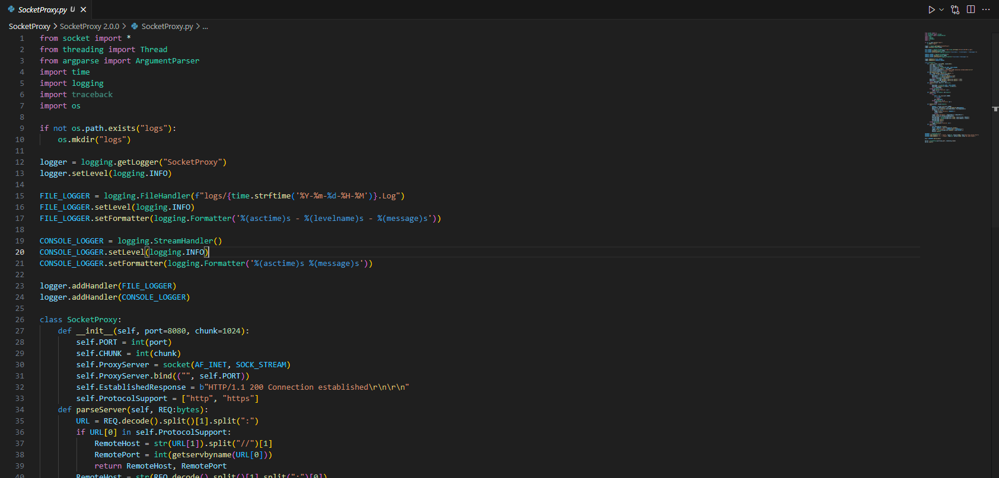
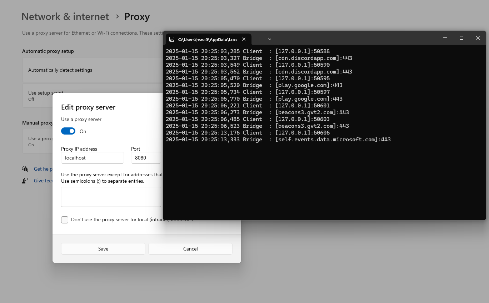
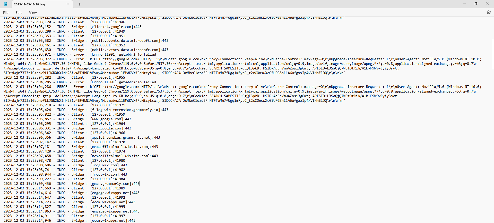

# SocketProxy
HTTP Proxy Server

## Project Description
SocketProxy is a **multi-threaded Python-based proxy server designed to facilitate data relay between clients and remote servers**.
It supports HTTP and HTTPS protocols, parsing client requests to identify the target host and port and establishing a connection to forward traffic.
The server is ***highly configurable, allowing users to set the listening port and data chunk size through command-line arguments***. Leveraging threading, SocketProxy efficiently manages multiple client connections simultaneously, ensuring high performance and reliability.
It features robust logging mechanisms, writing detailed logs to both console and files for monitoring and troubleshooting.
With its clean implementation and focus on simplicity, SocketProxy serves as a powerful tool for ***network debugging, traffic analysis, and learning about socket programming concepts***.

## Versions
| Version          | Interface                        | Source Code                                                                                                                                                            |
|:-----------------|:---------------------------------|:-----------------------------------------------------------------------------------------------------------------------------------------------------------------------|
| 1.0.0            | CLI                              | [https://github.com/mastermind65535/SocketProxy/blob/main/SocketProxy/SocketProxy%201.0.0/SocketProxy.py](https://github.com/mastermind65535/SocketProxy/blob/main/SocketProxy/SocketProxy%201.0.0/SocketProxy.py)     |
| 2.0.0            | CLI                              | [https://github.com/mastermind65535/SocketProxy/blob/main/SocketProxy/SocketProxy%202.0.0/SocketProxy.py](https://github.com/mastermind65535/SocketProxy/blob/main/SocketProxy/SocketProxy%202.0.0/SocketProxy.py)     |

## Pictures

